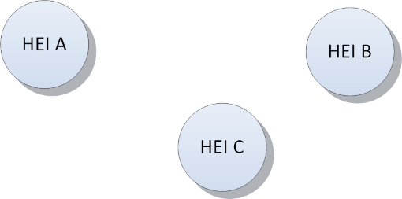
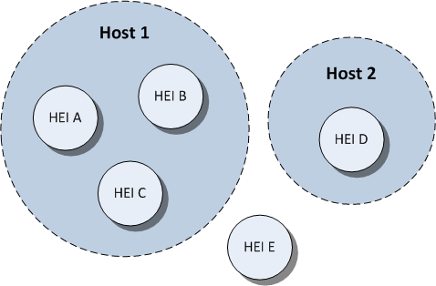
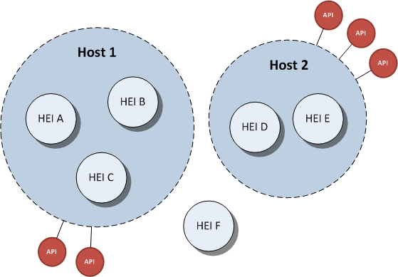
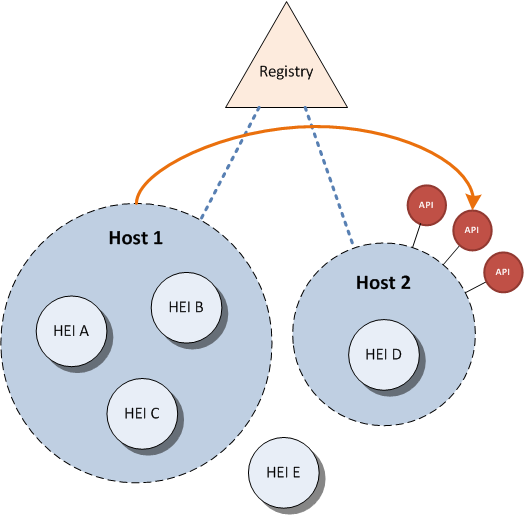

Architecture and Security
=========================

This document describes EWP Network components, establishes some common
security measures, features, data types and vocabulary, and explains how
partners communicate with themselves.

* [What is the status of this document?][statuses]
* [See the index of all other EWP Specifications][develhub]

How to join the EWP Network?
----------------------------

### Quick start

In order to join our network you'll need to:

 * Publish a valid [Discovery Manifest][discovery-api] somewhere on your
   servers.

 * Send the URL of your manifest to the EWP Registry maintainers. It will be
   stored in the EWP's [Registry Service][registry], allowing other partners to
   identify your HEIs and APIs, and verify your HTTP requests.

### Development environment

We keep an alternate instance of the Registry Service for development purposes:

 * https://dev-registry.erasmuswithoutpaper.eu/

This instance uses exactly the same [Registry API][registry-api] as the
[regular Registry Service][registry] does, but it describes an "EWP Developer
Network":

 * EWP Developer Network is completely separated from the actual EWP Network.

 * It contains URLs of individual developers' workstations, which may become
   offline at any time (developers are not required to keep their [discovery
   files][discovery-api] as up-to-date as the administrators of the "real"
   EWP Hosts are).

 * It may contain alpha implementations of unstable draft APIs.

 * It may contain references to non-existent HEIs. In fact, developers are
   encouraged to create many virtual HEIs to test *their own* client
   implementations against *their own* server implementations.

 * Otherwise, it uses **exactly the same protocols, security, and
   permissions**, as the actual EWP Network does. This means that you don't
   need any additional guidelines to join - the official EWP documentation
   should be enough.

To join EWP Developer Network, contact the dev-registry's administrators. You
will find their email addresses in the [dev-registry's catalogue
response][dev-catalogue-xml] (and if you're not sure how to read this XML, then
your should read the rest of this document first).

### Implementing APIs

Having completed the "Quick Start" steps described above, you will become a
member of the EWP Network, and you will be able to issue requests to other EWP
members (retrieve information from **other** institutions). You will NOT
however share any of **your** data yet - you'll need to implement some more
APIs to do that.

As part of the EWP project, we have designed a couple of APIs. Visit
[EWP Developers Page][develhub] for more information.

Core EWP components
-------------------

### HEIs

HEI is an acronym for **Higher Education Institution**. The EWP Project aims on
allowing communication between them.

### EWP Hosts

In order for the HEI to benefit from the EWP Project, it needs to be covered by
an EWP Host which implements some APIs.

 * A single **EWP Host** describes **a set of HEIs along with a set of
   implemented APIs**. We will describe the APIs in a moment. For now, let's
   focus on the HEIs. In the picture below, Host 1 **covers** institutions A, B
   and C, while institutions D and E are being covered by Host 2. Institution F
   is not covered by any host in the EWP network.

 * In some countries, there will be only a single EWP Host per country. In
   other countries every HEI will run its own EWP Host. Other more complex
   topologies are also possible (see [below](#network-topologies)).

### APIs

Apart from covering some HEIs, EWP Host also *implements* some APIs (for the
HEIs it covers). EWP Hosts are **not required** to implement *all* features of
the EWP Network. Each host can implement a different set of APIs. **They can
also expose APIs unrelated to EWP** (we do not enforce *any* requirements on
such APIs).

Let's say that HEI B wants to fetch some data from the EWP Network.

 * HEI B **knows** which API it wants to use, and it knows the ID of the HEI it
   wants to retrieve the data from (let's say it's HEI D).

 * HEI B **does not know** (yet) if HEI D implements the needed API and at
   which URL it is being served. (It doesn't even know yet if HEI D is *being
   covered* in the EWP Network at all.)

Host 1 needs the **Registry Service** in order to answer these questions.

### The Registry Service

The Registry Service is the only centralized part of the EWP architecture. It
allows all EWP hosts to access the list of other EWP hosts, and to list APIs
implemented by these hosts, along with the URLs these APIs are implemented at.
(It MAY also be used for projects unrelated to EWP, as long as these projects
have similar architectures.)

#### How is it updated?

The registry is being updated **automatically**. It periodically reads all
the information which all EWP Hosts provide within their [Discovery Manifest
files][discovery-api], and these changes are instantly reflected in the
Registry Service responses.

The major advantage of such automatic updating is that the partners *do not
need* to contact the registry maintainer when they want to change some of their
Registry entries. Most changes in the registry can be performed simply by
updating the manifest on **the partner's** server (and the Registry will fetch
these changes automatically). This process is both more convenient and more
secure than updating the registry manually.

#### Accessing the Registry

Let's continue the example use case we have started to describe earlier.

**HEI B** calls the EWP Registry Service. The Registry Service keeps track
of all the HEIs and their APIs. Given the Registry response, HEI B is now able
to determine which URL it needs to call in order to get the data. (In our
simple case, this URL will be served by Host 2.)

Detailed documentation on **how** to access the Registry, and how to determine
which URL to call, is part of the [Registry API specification][registry-api].

**Side-note** (for geeks only): Technically speaking, the Registry Service is
*also* an API, and it is also embedded inside its own EWP Host, like all the
other APIs. However, Registry's *EWP Host* does not cover any real HEIs and it
does not implement any other APIs (except the [Registry API][registry-api]).
Also the URLs at which the Registry API is implemented cannot change. So it's
quite different from all other EWP Hosts.

### How HEIs are covered by EWP Hosts

The picture above can be a bit misleading. You might think that all HTTP
requests in the EWP Network always originate from a single requesting HEI
(because both light-blue lines start at HEI B in the picture). This is not the
case.

Each request in the EWP Network is signed with a client certificate, and each
such client certificate is connected with a **group of HEIs**. So:

 * When Host 2 receives the request as pictured above, then - at first (based
   on the certificate used) - it only knows that it came from Host 1, not from
   HEI B in particular.

 * If the requested set of data should be visible to HEI B only (not HEI A nor
   C), then the requested API will often require an extra parameter to be
   provided along with each request to this API (e.g. `requesting_hei_id`).

 * Similarly, if the data HEI B is asking for is related to HEI D only, and the
   host is not able to deduce this fact from other parameters, then the API
   will also often require another parameter which will help the Host to
   identify the HEI which to pull the data from (e.g. `responding_hei_id`).

This might be a bit confusing at first glance, but it shouldn't make your work
any harder. And, in case of some partners, it may actually allow them to
exchange data in a more efficient way.

It's worth noting that we have considered simpler architectures too (e.g. one
EWP Host per HEI), but we have concluded that some partners are willing to
leverage this more flexible design. See [this thread]
(https://github.com/erasmus-without-paper/ewp-specs-api-echo/issues/3)
if you're interested in the details.

### More complex network topologies

As we have indicated before, Registry Service allows HEI B to easily answer the
questions like "is API X implemented for HEI Y?" and "which URL is the API
implemented at?". However, the network in our example is quite simple. EWP
Hosts allow us to describe much more complex topologies.

**Example 1:**

API implementations can be hosted across multiple servers and/or domains (which
might be convenient, especially if you work with multiple developer teams, each
one of which might want to use their favorite languages and environments.

If you choose to implement your APIs on many servers, then **you might also
want to host multiple Discovery manifest files** (one for each of your
servers), thus creating multiple EWP Hosts. This is allowed in the EWP Network
(one HEI can be covered by many EWP Hosts). Note, that this does not matter
from the client's view point - **the client only needs to know which URL to
call** to get the data it needs, and it doesn't need to know which EWP Host
serves this URL. See [Registry API] [registry-api] for examples.

**Example 2:**

If your institution covers multiple HEIs, but - for some reason - you can
implement an API for only some of these HEIs, then you might want to split your
EWP Host into a couple of smaller ones. In other words, you may choose to have
a single EWP Host per a single HEI, even if you are a SAAS provider for
multiple HEIs.

Security and Authentication
---------------------------

*Note: This chapter is a recommendation, not a requirement. Most (if not all)
our APIs follow these guidelines, but it is perfectly okay to use EWP Registry
to publish an API that does things differently.*

### Certificates

We use HTTPS protocol for encrypting and signing all EWP communication. There
are two types of certificates which all implementers must be aware of:

 * **Server certificates** are used by the Host when it **responds** to HTTPS
   API requests.
 * **Client certificates** are used to **make HTTPS requests** within the EWP
   Network.

Implementers MAY use the same certificate for both purposes, but it is NOT
REQUIRED.

#### Server certificates

These are just "regular" SSL certificates, that is - they are bound to your
domain, and are signed by a trusted CA. Neither the clients nor the registry
will be storing your server certificates - they will be validated "the regular
HTTPS way" (via CA signature).

All implemented APIs MUST be served via the HTTPS protocol. This allows the
clients to verify that responses come from the proper source.

Note, that APIs can be spread across multiple domains (and all these domains
will be referenced in the `<apis-implemented>` section of the [Manifest file]
[discovery-api]). The number of domains used to implement EWP does not matter,
but all of them need to be protected by proper certificates issued for these
domains.

#### Client certificates

Each EWP Host declares (via its [Manifest file][discovery-api]) a list of
certificates it will use for making requests to other hosts. This list is
later fetched by registry, and the **fingerprints** of these certificates are
served to all interested parties to see (see [Registry API][registry-api] for
details).

All of your clients are required to use one of such published client
certificates when making requests within the EWP Network. Once the server
confirms that the client is in possession of a proper private key of the
certificate (this is the part of the TLS Handshake), it is then able to
identify (with the help of the Registry again) which HEIs such client covers.

This setup has many advantages:

 * During development stages, it allows developers to generate their own
   self-signed certificates and install them in their browsers for debugging
   purposes.

 * If a single EWP Host changes its client certificate, but forgets to update
   its manifest, then only this single EWP Host will be affected.

 * You may delegate the duty of serving some of your APIs directly to a third
   party (no proxy needed), but still keep the client credentials for yourself
   (the third party won't be able to perform requests in the EWP Network unless
   it holds a private key for at least one of the certificates present in your
   manifest).

 * Similarly, if you are a SAAS provider, you can delegate the permission of
   making requests *in the name of a single HEI* to one of your clients (as
   opposed to a permission to make requests in the name of all of your covered
   HEIs).

### Should I verify *all* requests?

No. Just some.

Every API defines its own security requirements. In most cases it *will* be
REQUIRED for the EWP Host to verify its requester, but in some other cases
(e.g. the Discovery Manifest API) it will be the opposite - some requests MUST
be allowed to be performed by **anonymous** requesters (with no client
certificate).

Here are some examples of security policies we might use:

 * **Anonymous access**: The request can be made by anyone. The client does not
   need to use any SSL certificate.

 * **Access to anyone from within the EWP Network**: Clients are required to
   use a proper certificate when performing requests.

 * **Access to anyone who covers a specific HEI**: Clients are required to use
   a proper certificate when performing requests, and this certificate must
   belong to an EWP Host associated with particular HEI. Other EWP Hosts will
   not be able to access the resource. (This will probably be the most common
   policy across EWP APIs, as the project focuses on exchanging data between
   HEIs.)

Please review the [Echo API][echo-api] specs for a more detailed explanation of
the request-validation process.

### Should I verify *all* responses?

Yes.

It is RECOMMENDED for all EWP Clients to verify the SSL server certificates
when retrieving responses from other EWP Hosts. You will use just the "regular"
SSL verification (you do not need to analyze server certificates manually, as
you do in case of client certificates). You simply need to check if the
server's certificate is valid (signed by a trusted CA).

Other Recommendations
---------------------

It is true, that this chapter describes general EWP Network recommendations,
**not requirements**. This means that it is perfectly okay to use EWP Registry
to publish an API that doesn't follow the following guidelines.

However, it is also true, that many EWP APIs explicitly REQUIRE these
guidelines to be followed - it is a per-API design decision. In other words,
**you still MUST follow these guidelines** when implementing most of the APIs.

### Error handling

This chapter describes general error handling rules, which are followed by most
of the EWP APIs whenever an error occurs.

 * If the service is **temporarily unavailable** for some reason (like
   maintenance), then servers MUST respond with the HTTP 5xx status
   (**HTTP 503** preferred), and the response MAY also contain an XML content
   with the `<error-response>` root element, as defined in the
   [common-types.xsd](common-types.xsd) file.

 * If the client **doesn't have access** to the resource (or didn't provide his
   credentials, i.e. SSL client certificate), then servers MUST respond with
   the HTTP 4xx status (**HTTP 403** preferred), and the response SHOULD
   contain an XML content with the `<error-response>` root element, as defined
   in the [common-types.xsd](common-types.xsd) file.

 * If the client used an **inappropriate HTTP method** (e.g. GET, when only
   POST is allowed), then servers MUST respond with the HTTP 4xx status
   (**HTTP 405** preferred), and the response SHOULD contain an XML content
   with the `<error-response>` root element, as defined in the
   [common-types.xsd](common-types.xsd) file.

 * If the client provided **invalid parameters** for the request (such that do
   not conform to the requirements of the API), then servers MUST respond with
   the **HTTP 400** status, and the response SHOULD contain an XML content
   with the `<error-response>` root element, as defined in the
   [common-types.xsd](common-types.xsd) file.

 * If some other **server error** occurs while processing the request (i.e.
   uncaught exception), then servers MUST respond with the **HTTP 500** status,
   and the response MAY contain an XML content with the `<error-response>` root
   element, as defined in the [common-types.xsd](common-types.xsd) file.

These rules allow the clients to determine when they are doing something wrong.
In particular:

 * Whenever a client receives an unexpected **HTTP 4xx** error, it knows that
   there's some bug in its code which requires fixing.

 * Whenever a client receives a **HTTP 5xx** error, it knows that it's not "his
   fault", and that it can (often automatically) retry the request later on.

### Backward-compatibility rules

This chapter describes basic backward-compatibility rules, which are followed
by most of the EWP APIs (it's not a strict requirement for all new APIs, only
a recommendation). They are important during all stages: the API design, server
development, and client development.

 * Adding a new **optional** element to an XML file is backward-compatible.
   Client implementers MUST ignore unknown elements. If an element has not
   existed in version `1.0.0`, but you want it to exist in the next version,
   then you can tag the next version as `1.1.0`.

 * Adding a new **required** element to an XML file is NOT backward-compatible.
   All hosts which implement this API will need to be upgraded, and designers
   MUST bump the API version to `2.0.0` (unless perhaps if the API is being
   implemented by a single host only, e.g. the Registry API).

 * Changing an existing element is *usually* NOT backward-compatible. For
   example, if the element contained an integer in version `1.0.0`, but API
   designers want it to be able to contain a float from now on, then they MUST
   increase the version number to `2.0.0`.

 * Adding an **optional** parameter to the API method interface is
   backward-compatible, as long as the default value for the newly added
   element doesn't change the method output which the older clients expect to
   receive.

 * It is worth noting that servers MAY serve multiple major versions of a
   single API at the same time. Releasing a new major version causes the API's
   XML namespace to be changed, so this won't cause any conflicts (see
   [Discovery API][discovery-api] for details).

### Push notifications (and broadcasting)

What if HEI B wanted to **notify** HEI D when something is changed, instead of
requiring HEI D to ask periodically? E.g. a student has just failed an exam at
B and we suspect that D would want to be notified instantly?

Some of the APIs are **Change Notification Receiver (CNR) APIs**. If Host 2
(the one which covers HEI D) wants to receive such notifications from other
hosts, it indicates that it has implemented a specific CNR API in its Manifest
file. Now, if HEI B wants to broadcast a notifications, then it first asks the
Registry for URLs of all related CNR APIs, and then it posts the proper
notifications at the listening URLs.

It's worth noting that HEI D will usually NOT be required to broadcast such
notifications (even if all other hosts implement CNR APIs and want to receive
them). Implementers MAY choose to implement only a subset of push
notifications, or even not implement them at all (thus forcing the other side
to periodically pull the data instead). You will find more information on this
in the documentation of specific CNR APIs.

[discovery-api]: https://github.com/erasmus-without-paper/ewp-specs-api-discovery
[develhub]: http://developers.erasmuswithoutpaper.eu/
[statuses]: https://github.com/erasmus-without-paper/ewp-specs-management/blob/stable-v1/README.md#statuses
[registry]: https://registry.erasmuswithoutpaper.eu/
[registry-api]: https://github.com/erasmus-without-paper/ewp-specs-api-registry
[echo-api]: https://github.com/erasmus-without-paper/ewp-specs-api-echo
[dev-catalogue-xml]: https://dev-registry.erasmuswithoutpaper.eu/catalogue-v1.xml
