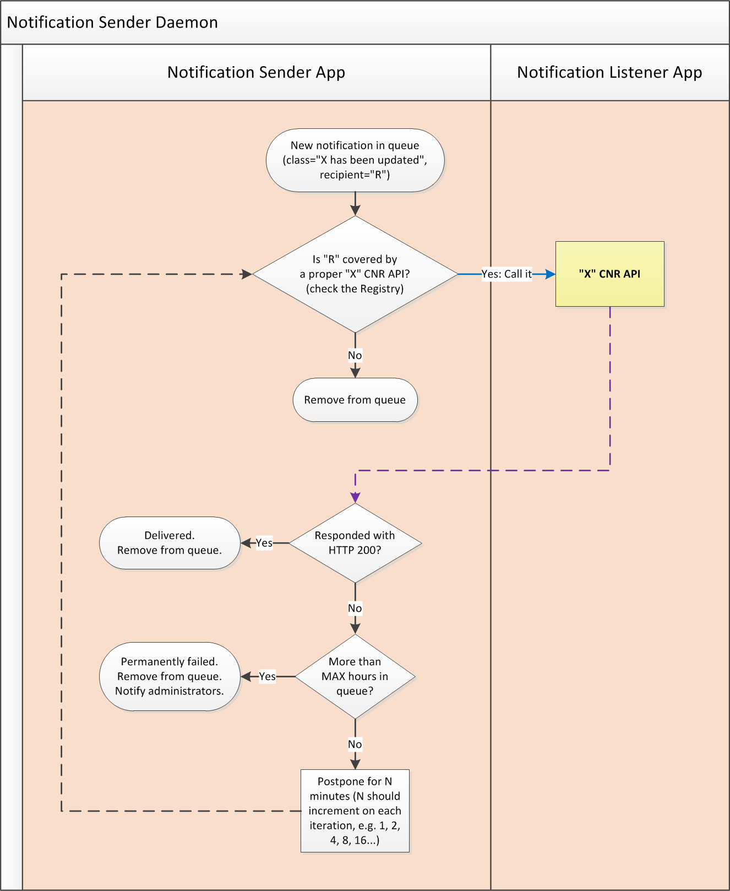

Architecture and Common Datatypes
=================================

This document describes EWP vocabulary, network components, common features and
data types, and explains basic rules about how partners communicate with each
other and handle errors.

* [What is the status of this document?][statuses]
* [See the index of all other EWP Specifications][develhub]


How to join the EWP Network?
----------------------------

### Quick start

In order to join our network you'll need to:

 * Publish a valid [Discovery Manifest][discovery-api] somewhere on your
   servers.

 * Send the URL of your manifest to the EWP Registry maintainers. It will be
   stored in the EWP's [Registry Service][registry], allowing other partners to
   identify your HEIs and APIs, and verify your HTTP requests.


### Development environment

We keep an alternate instance of the Registry Service for development purposes:

 * https://dev-registry.erasmuswithoutpaper.eu/

This instance uses exactly the same [Registry API][registry-api] as the
[regular Registry Service][registry] does, but it describes an "EWP Developer
Network":

 * EWP Developer Network is completely separated from the actual EWP Network.

 * It contains URLs of individual developers' workstations, which may become
   offline at any time (developers are not required to keep their [discovery
   files][discovery-api] as up-to-date as the administrators of the "real"
   EWP Hosts are).

 * It may contain alpha implementations of unstable draft APIs.

 * It may contain references to non-existent HEIs. In fact, developers are
   encouraged to create many virtual HEIs to test *their own* client
   implementations against *their own* server implementations.

 * Otherwise, it uses **exactly the same protocols, security, and
   permissions**, as the actual EWP Network does. This means that you don't
   need any additional guidelines to join - the official EWP documentation
   should be enough.

To join EWP Developer Network, contact the dev-registry's administrators. You
will find their email addresses in the [dev-registry's catalogue
response][dev-catalogue-xml] (and if you're not sure how to read this XML, then
your should read the rest of this document first).


### Implementing APIs

Having completed the "Quick Start" steps described above, you will become a
member of the EWP Network, and you will be able to issue requests to other EWP
members (retrieve information from **other** institutions). You will NOT
however share any of **your** data yet - you'll need to implement some more
APIs to do that.

As part of the EWP project, we have designed a couple of APIs. Visit
[EWP Developers Page][develhub] for more information.


<a name="components"></a>

Core EWP components
-------------------

### HEIs

HEI is an acronym for **Higher Education Institution**. The EWP Project aims on
allowing communication between them.


### EWP Hosts

In order for the HEI to benefit from the EWP Project, it needs to be covered by
an EWP Host which implements some APIs.

 * A single **EWP Host** describes **a set of HEIs along with a set of
   implemented APIs**. We will describe the APIs in a moment. For now, let's
   focus on the HEIs. In the picture below, Host 1 **covers** institutions A, B
   and C, while institutions D and E are being covered by Host 2. Institution F
   is not covered by any host in the EWP network.

 * In some countries, there will be only a single EWP Host per country. In
   other countries every HEI will run its own EWP Host. Other more complex
   topologies are also possible (see [below](#network-topologies)).


### APIs

Apart from covering some HEIs, EWP Host also *implements* some APIs (for the
HEIs it covers). EWP Hosts are **not required** to implement *all* features of
the EWP Network. Each host can implement a different set of APIs. **They can
also expose APIs unrelated to EWP** (we do not enforce *any* requirements on
such APIs).


Let's say that HEI B wants to fetch some data from the EWP Network.

 * HEI B **knows** which API it wants to use, and it knows the ID of the HEI it
   wants to retrieve the data from (let's say it's HEI D).

 * HEI B **does not know** (yet) if HEI D implements the needed API and at
   which URL it is being served. (It doesn't even know yet if HEI D is *being
   covered* in the EWP Network at all.)

Host 1 needs the **Registry Service** in order to answer these questions.


<a name="registry"></a>

### The Registry Service

The Registry Service is the only centralized part of the EWP architecture. It
allows all EWP hosts to access the list of other EWP hosts, and to list APIs
implemented by these hosts, along with the URLs these APIs are implemented at.
(It MAY also be used for projects unrelated to EWP, as long as these projects
have similar architectures.)


#### How is it updated?

The registry is being updated **automatically**. It periodically reads all
the information which all EWP Hosts provide within their [Discovery Manifest
files][discovery-api], and these changes are instantly reflected in the
Registry Service responses.

The major advantage of such automatic updating is that the partners *do not
need* to contact the registry maintainer when they want to change some of their
Registry entries. Most changes in the registry can be performed simply by
updating the manifest on **the partner's** server (and the Registry will fetch
these changes automatically). This process is both more convenient and more
secure than updating the registry manually.


#### Accessing the Registry

Let's continue the example use case we have started to describe earlier.

**HEI B** calls the EWP Registry Service. The Registry Service keeps track
of all the HEIs and their APIs. Given the Registry response, HEI B is now able
to determine which URL it needs to call in order to get the data. (In our
simple case, this URL will be served by Host 2.)

Detailed documentation on **how** to access the Registry, and how to determine
which URL to call, is part of the [Registry API specification][registry-api].

**Side-note** (for geeks only): Technically speaking, the Registry Service is
*also* an API, and it is also embedded inside its own EWP Host, like all the
other APIs. However, Registry's *EWP Host* does not cover any real HEIs and it
does not implement any other APIs (except the [Registry API][registry-api]).
Also the URLs at which the Registry API is implemented cannot change. So it's
quite different from all other EWP Hosts.


### How HEIs are covered by EWP Hosts

The picture above can be a bit misleading. You might think that all HTTP
requests in the EWP Network always originate from a single requesting HEI
(because both light-blue lines start at HEI B in the picture). This is not the
case.

Non-anonymous requests in the EWP Network are performed with use of client
credentials. Each set of client credentials is connected with a **group of
HEIs**. So:

 * When Host 2 receives the request as pictured above, then - at first (based
   on the credentials used) - it only knows that it came from Host 1, not from
   HEI B in particular.

 * If the requested set of data should be visible to HEI B only (not HEI A nor
   C), then the requested API will often require an extra parameter to be
   provided along with each request to this API (e.g. `requesting_hei_id`).

 * Similarly, if the data HEI B is asking for is related to HEI D only, and the
   host is not able to deduce this fact from other parameters, then the API
   will also often require another parameter which will help the Host to
   identify the HEI which to pull the data from (e.g. `responding_hei_id`).

This might be a bit confusing at first glance, but it shouldn't make your work
any harder. And, in case of some partners, it may actually allow them to
exchange data in a more efficient way.

It's worth noting that we have considered simpler architectures too (e.g. one
EWP Host per HEI), but we have concluded that some partners are willing to
leverage this more flexible design. See
[this thread](https://github.com/erasmus-without-paper/ewp-specs-api-echo/issues/3)
if you're interested in the details.


<a name='network-topologies'></a>

### More complex network topologies

As we have indicated before, Registry Service allows HEI B to easily answer the
questions like "is API X implemented for HEI Y?" and "which URL is the API
implemented at?". However, the network in our example is quite simple. EWP
Hosts allow us to describe much more complex topologies.

**Example 1:**

API implementations can be hosted across multiple servers and/or domains (which
might be convenient, especially if you work with multiple developer teams, each
one of which might want to use their favorite languages and environments.

If you choose to implement your APIs on many servers, then **you might also
want to host multiple Discovery manifest files** (one for each of your
servers), thus creating multiple EWP Hosts. This is allowed in the EWP Network
(one HEI can be covered by many EWP Hosts). Note, that this does not matter
from the client's view point - **the client only needs to know which URL to
call** to get the data it needs, and it doesn't need to know which EWP Host
serves this URL. See [Registry API] [registry-api] for examples.

**Example 2:**

If your institution covers multiple HEIs, but - for some reason - you can
implement an API for only some of these HEIs, then you might want to split your
EWP Host into a couple of smaller ones. In other words, you may choose to have
a single EWP Host per a single HEI, even if you are a SAAS provider for
multiple HEIs.


Other Recommendations
---------------------

### Recommendations or requirements?

It is true, that this chapter describes general EWP Network recommendations,
**not requirements**. This means that it is perfectly okay to use EWP Registry
to publish an API that *doesn't* follow these guidelines.

However, it is also true, that most EWP APIs explicitly REQUIRE these
guidelines to be followed - it is a per-API design decision. In other words,
**you still MUST follow these guidelines** when implementing most of EWP APIs!


<a name='error-handling'></a>

### Error handling

This chapter describes general error handling rules, which are followed by most
of the EWP APIs whenever an error occurs.

 * If the service is **temporarily unavailable** for some reason (like
   maintenance), then servers MUST respond with the HTTP 5xx status
   (**HTTP 503** preferred), and the response MAY also contain an XML content
   with the `<error-response>` root element, as defined in the
   [common-types.xsd](common-types.xsd) file.

 * If the client **doesn't have access** to the resource (or didn't provide his
   credentials, i.e. SSL client certificate), then servers MUST respond with
   the HTTP 4xx status (**HTTP 403** preferred), and the response SHOULD
   contain an XML content with the `<error-response>` root element, as defined
   in the [common-types.xsd](common-types.xsd) file.

 * If the client used an **inappropriate HTTP method** (e.g. GET, when only
   POST is allowed), then servers MUST respond with the HTTP 4xx status
   (**HTTP 405** preferred), and the response SHOULD contain an XML content
   with the `<error-response>` root element, as defined in the
   [common-types.xsd](common-types.xsd) file.

 * If the client provided **invalid parameters** for the request (such that do
   not conform to the requirements of the API), then servers MUST respond with
   the **HTTP 400** status, and the response SHOULD contain an XML content
   with the `<error-response>` root element, as defined in the
   [common-types.xsd](common-types.xsd) file.

   - If there's reason to suspect that the invalid parameters **might have**
     been caused by the user, not the developer, then the server SHOULD also
     include the `<user-message>` element in its `<error-response>`. This way,
     the client will be able to inform his user what he did wrong.

     **How to tell the difference?** First, you should note, that some APIs
     *don't* specify some things *exactly*. This means that server
     implementers are free to choose some things on their own (e.g. the maximum
     length of a comment, the valid preconditions for approving a nomination,
     etc.). In such cases the client implementers cannot be blamed for the fact
     that they allowed their users to send such "possibly invalid" data
     (because neither them, not their users *know* about those extra
     limitations). And that's exactly when the `<user-message>` element comes
     handy. It allows the users and client developers to send invalid data
     sometimes, but it also allows those users to be instructed (directly by
     the server) about what they did wrong. For example: *Sorry, but University
     of Warsaw doesn't allow comments longer than 1000 characters. Please make
     your comment shorter and repeat your request.*

   - There's also one special scenario caused by invalid parameters, which is
     related to [edit conflicts](https://en.wikipedia.org/wiki/Edit_conflict).
     These conflicts can appear in some APIs, but only those in which the
     client is allowed to *change* something on the server. When edit conflicts
     are detected, the server MUST respond with the **HTTP 409** error status
     (see also [here][http-409]), preferrably along with some message for the
     user (the `<user-message>` element).

     Any possible edit conflicts SHOULD be described in respective APIs. For
     example, see the `update` endpoint of the [Outgoing Mobilities
     API][omobilities-api].

 * If some other **server error** occurs while processing the request (i.e.
   uncaught exception), then servers MUST respond with the **HTTP 500** status,
   and the response MAY contain an XML content with the `<error-response>` root
   element, as defined in the [common-types.xsd](common-types.xsd) file.

These rules allow the clients to determine when they are doing something wrong.
In particular:

 * Whenever a client receives an unexpected **HTTP 4xx** error, it knows that
   there's some bug in its code which requires fixing.

 * Whenever a client receives a **HTTP 5xx** error, it knows that it's not "his
   fault", and that it can (often automatically) retry the request later on.

It's worth noting, that error responses SHOULD attempt to follow all security
policies of the endpoint. For example, if the endpoint signs (and/or encrypts)
all its regular HTTP 200 responses, then it also SHOULD sign (and/or encrypt)
its HTTP 4xx and 5xx responses (with exactly the same algorithms it uses for
HTTP 200 responses). Read [this document][error-signing] for more information.


<a name='ids'></a>

### Identifiers (surrogate vs. natural keys)

Majority of our schemas require partners to supply both
[surrogate](https://en.wikipedia.org/wiki/Surrogate_key) and
[natural](https://en.wikipedia.org/wiki/Natural_key) keys for their
entities. **We refer to surrogate keys as "IDs"** (e.g. `los_id`), while
**natural keys are called "codes"** (e.g. `los_code`):

 * Both sets of keys are **required to be unique** (case-sensitive). A code MAY
   change in time, but at any single point in time, it should uniquely identify
   a single entity.

 * Identifiers (surrogate keys) are generally **hidden** from the end users.
   Codes (natural keys) are not (it is RECOMMENDED to display them).

   * If a computer program wants to find an entity, **it will use the ID**.
   * If a user wants to find an entity, he will use the **code**. (So, it's
     also RECOMMENDED to keep your codes short, simple and within the Latin
     alphabet).

 * Most of our APIs require server implementers to allow entity matching by
   using any one of those (either ID or the code). In cases where an **exact
   match** is expected to be found, both identifiers and codes are REQUIRED to
   be compared as **case-sensitive strings**. For example, all following
   statements are true:

   ```
   "A123" != "a123"
   "82cf3566-4ea1-4b14-b253-de9a68881fff" != "82CF3566-4EA1-4B14-B253-DE9A68881FFF"
   "82cf3566-4ea1-4b14-b253-de9a68881fff" != "82cf35664ea14b14b253de9a68881fff"
   "123" != "0123"
   "123" != "123.0"
   ```

 * If the partner's database stores **surrogate keys only**, then he MAY simply
   supply his surrogate key in the code. It this case, it is recommended that
   such surrogate keys are short (e.g. integers instead of UUIDs).

 * If the partner's database stores **natural keys only**, then he is REQUIRED
   to **add a new column for the surrogate key**.

   The **only exemption** from this requirement is the following situation:

   * The partner can guarantee with a 100% of certainty that his natural keys
     will never change. This means that his customers (the HEIs) **will never
     be allowed** to rewrite these keys. (In most cases, you won't be able to
     guarantee such things.)

   * All values of the natural key match the restrictions we put upon the
     surrogate key (see below).

Additionally, we need to put some **limitations on identifiers values**
themselves (surrogate keys):

 * Identifiers are REQUIRED to have the length between 1 and 64 characters.
 * Identifiers are REQUIRED to consist of printable characters (space not
   included) in the [Basic Latin Unicode block][latin] (`U+0021`..`U+007E`).
 * It is RECOMMENDED to avoid using punctuation and symbol characters.

This allows implementers to easily store remote identifiers in a `varchar(64)`.
Please note, that these limitations are for identifiers only, not the codes!
Codes MAY contain any range of Unicode characters, and EWP doesn't currently
put any length limits on them.

There's one more recommendation to consider:

 * It is RECOMMENDED to make all your identifiers (surrogate keys)
   **universally** unique. Consider the advantages of this strategy when, for
   example, two EWP HEIs decide to merge together (and such things do happen!).
   [UUIDs](https://en.wikipedia.org/wiki/Universally_unique_identifier) (in
   their canonical form) are probably the most widely adopted format for
   universally unique identifiers.

   Obviously, if you decide *not* to follow this recommendation, all your
   identifiers still MUST uniquely identify your entities within each single
   HEI you cover.


<a name='referential-integrity'></a>

### Referential integrity

Most EWP API servers are required to keep
[referential integrity][ref-integrity-wiki].

Some partners might want to *not* expose all of their entities for EWP members.
They might want to expose only a selected subset of them (for example, only
the courses conducted in English, or only the mobilities no older than a year,
etc.).

You, as a server developer, are **allowed to hide some of your entities** from
some (or from all) of the other partners, but if you do, then **you MUST hide
them consistently**, so that referential integrity is not broken. If you don't,
your clients will get unearned HTTP 400 errors (and they might try to search
for the source of this bug in their own applications, while the bug will really
be on the server side).

For example, if you decide that a course `los_id=X` should not be accessible
via the Courses API, then you MUST NOT return a reference to
`<los-id>X</los-id>` in *none of the other APIs* too. (Such visibility MAY vary
on requester, but it MUST be consistent for any single requester.)

Obviously, the easiest way to satisfy this requirement is to decide *not to
hide things* - then you won't have to worry if you leave a reference to it or
not. *If* you decide to hide some entities however, then you MUST do this
consistently.


<a name='old-data'></a>

### Keeping old data

As service providers, EWP Partners are in no position to tell their customers
(HEIs) how long they have to keep their data. When a HEI decides to delete all
personal data at the time where it is no longer needed, then its gone.

However, what we can do is to RECOMMEND that such old entities should be kept
online for at least some time before disappearing, so that all other partners
can realize what is happening.

**Example:**

 * If a mobility `X` is cancelled at the sending HEI `S`, and the receiving HEI
   `R` is then asking for an update on `X`, then it is RECOMMENDED to respond
   with a valid `X` mobility response **with the `cancelled` status**, rather
   than returning HTTP 400 with the message "X does not exist".

 * Such cancelled mobilities can of course be removed later in time, but they
   SHOULD NOT be removed instantly after they're cancelled. The same
   recommendation applies to all other entities.


<a name='backward-compatibility-rules'></a>

### Backward-compatibility rules

This chapter describes basic backward-compatibility rules, which are followed
by most of the EWP APIs (it's not a strict requirement for all new APIs, only
a recommendation). They are important during all stages: the API design, server
development, and client development.

 * Adding a new **optional** element to an XML file is backward-compatible.
   Client implementers MUST ignore unknown elements. If an element has not
   existed in version `1.0.0`, but you want it to exist in the next version,
   then you can tag the next version as `1.1.0`.

 * Adding a new **required** element to an XML file is NOT backward-compatible.
   All hosts which implement this API will need to be upgraded, and designers
   MUST bump the API version to `2.0.0` (unless perhaps if the API is being
   implemented by a single host only, e.g. the Registry API).

 * Changing an existing element is *usually* NOT backward-compatible. For
   example, if the element contained an integer in version `1.0.0`, but API
   designers want it to be able to contain a float from now on, then they MUST
   increase the version number to `2.0.0`.

 * Adding an **optional** parameter to the API method interface is
   backward-compatible, as long as the default value for the newly added
   element doesn't change the method output which the older clients expect to
   receive.

 * It is worth noting that servers MAY serve multiple major versions of a
   single API at the same time. Releasing a new major version causes the API's
   XML namespace to be changed, so this won't cause any conflicts (see
   [Discovery API][discovery-api] for details).


<a name='cnr'></a>

### Broadcasting changes ("CNR" APIs)

What if EWP Host `X` wanted to **notify** other EWP Hosts (like `Y`) when
something is changed (inserted, updated **or deleted**), instead of requiring
`Y` to ask periodically?

In EWP, we have designed a concept called **Change Notification Receiver (CNR)
APIs**. These APIs are simply an application of the [publish-subscribe
pattern](https://en.wikipedia.org/wiki/Publish%E2%80%93subscribe_pattern),
which also happens to fit well with our architecture and terminology.


#### Client part (receiving notifications)

If EWP Host `Y` wants to receive notifications from other hosts, it indicates
so by implementing a chosen CNR API (depending on the type of entity they would
like to watch), and publishing this fact in its [manifest file][discovery-api].
There are a couple of classes of such notifications - implementing a specific
CNR API is like "subscribing" to receive specific classes of notifications.

In other words, **CNR APIs are simply callback URLs** for [push
notifications](https://en.wikipedia.org/wiki/Push_technology).

However, it's worth noting that `X` will not necessarily be required to
actually *send* the notifications (even if all other EWP Hosts are ready to
receive them). Server implementers MAY choose to implement only a subset of
push notifications, or even not implement them at all (thus forcing the other
side to periodically pull the data instead). **The possibility of network
failures and programming errors are also valid issues to expect.**

This means that - as a client - you MUST NOT truly rely that implementing CNR
APIs is sufficient to keep your copy of the data up-to-date. You SHOULD either:

 * Avoid storing the data permanently (i.e. avoid keeping it in the database).
   Instead, you might want to *cache it*, and clear the cache after some time,
   or after receiving a CNR notification. This forces your application to
   re-fetch the fresh data whenever it is actually needed.

 * If you prefer keeping the data in the database, then you might keep a
   "last confirmed" date along with it. Once the date get old, you may run a
   background worker to refresh the stale data. It is recommended to do this
   during the server night-time hours, and make use of the optimization
   features such as the `modified_since` parameters (if present).

 * Regardless of which of the two methods above you choose, it is also
   recommended to allow your end-users to refresh an entity manually. Just put
   a "refresh now" button in your user interface. It will make the work of your
   users much easier when they are having a live conversation with each other
   over the phone.


#### Server part (sending notifications)

In principle, it seems simple - when an EWP Host `X` wants to broadcast a
notification, then:

 * It first asks the Registry Service for the URLs of all related CNR APIs.
 * It pushes (sends a POST request) proper notifications at the listening URLs.

This process however is not as simple as it sounds. In order for this model
to work faultlessly, the server SHOULD also gracefully handle temporary I/O
errors (caused by, for example, a malfunction on the receiver's servers, or a
misconfiguration on the sender's network, etc.). And this means that you SHOULD
have a specialized queue-based component for the job. Let's call it an **EWP
Notification Sender Daemon**.



It works like this:

 * Once you detect a change in one of your entities, you push its ID to the
   queue. If is recommended for the queue to be backed by a persistent storage
   engine (e.g. a separate table in a database), to avoid missing notifications
   after service is restarted.

   Note that creating or deleting an entity also counts as a change. It's still
   enough to send the ID of the changed entity only (you don't need to store
   the type of this change). For example, if an IIA draft is deleted, and the
   clients receives an IIA CNR with the ID of this deleted IIA, then he will be
   able to determine that it indeed has been deleted (by querying IIAs API and
   receiving no matching IIA).

 * Notification Sender actively watches the queue for the list of changed
   IDs, it also watches the Registry Service for the list of the listening CNR
   APIs, and then - for each listener - attempts to send it the list of all IDs
   that were changed.

   The sender is allowed to postpone sending some notifications so that it will
   later be able to send them in bulk (e.g. to reduce bandwidth usage).
   However, please note, that all such delays may reduce user-experience. It
   is not recommended to delay notifications for longer than 5 minutes.

 * If CNR API doesn't respond, or it responds with a HTTP 5xx error, then the
   sender SHOULD retry delivering the notification after some time.

   To avoid unnecessary network traffic, it is recommended to use some kind of
   an [exponential backoff](https://en.wikipedia.org/wiki/Exponential_backoff)
   strategy when repeating your requests. Undelivered requests MAY expire after
   some time (e.g. 24 hours).

 * Additionally, the server also publishes the information that it has
   implemented the notification-sending feature by adding a proper
   `<sends-notifications/>` element to respective entity serving APIs (see
   `manifest-entry.xsd` files in respective APIs). Clients MAY use this
   information to choose different refresh strategies per each partner.


#### Why "change notifications" instead of actual "changes"?

Our CNR APIs notify the listening partners that certain entities have been
recently updated, but they do not inform them **what exactly** has been
changed.

There are a couple of reasons for this design:

 * In most EWP APIs we use the [master/slave][master-slave] communication
   model:

   - The master serves its entities as they are (e.g. via the `get` endpoint
     of Outgoing Mobilities API). The master server can always be certain that
     its data is up-to-date.

   - The slave, if he wants to change something, then he MUST do so directly
     on the master server (e.g. by calling the `update` endpoint of his
     Outgoing Mobilities API). The slave MAY keep a copy of the data, but he
     cannot just make changes to this copy without master's "approval".

   In this model, the slave can never be 100% sure that his copy of the
   data is up-to-date. Conflicts are always possible (e.g. the slave is trying
   to `UPDATE` an entity which has just been `DELETE`d from the master).
   **These conflicts need to be resolved by the slave.**

   This means that regardless of the synchronization method we choose, the
   slave still MUST implement a "refresh procedure" - a piece of code which
   *compares* his "slave" data with the "master" copy, detects differences, and
   acts on these differences (synchronizes them, sends notifications, etc.).

   Refresh procedures are not easy to write, but since they are needed anyway,
   it seems reasonable to reuse them. And so, we made these refresh procedures
   a central part of our replication. In most cases, implementing a CNR API is
   **nothing more than performing a refresh procedure on a given set of
   objects**.

   EWP's "refresh" procedures are also known as "reload", "reset" or "re-sync"
   procedures in database replication world, but the meaning is slightly
   different. In our case we will *usually* want to refresh small sets of
   entities, rather than reloading all of them. A "full" refresh is only
   required after a slave system failure (when CNRs are not listening), or -
   periodically - if we suspect that the master implementation is flawed and
   fails to (or chooses not to) deliver notifications (and this *will* happen,
   we're not infallible).

 * Notification Sender sends tiny objects. Each notification on the queue uses
   the **minimal amount of memory**. With more memory free, it is easier for
   the daemon implementers to keep **longer delivery-expiry timeout periods**.

 * When a single entity is changed multiple times in rapid succession (which is
   a pretty common use case!), it is very simple to "merge" all such changes
   into a single, tiny notification.

 * **Synchronization problems are quite easy to handle.** If change `N` reaches
   the requester after change `N+1` does, then the possible effects of this
   fact are much easier to comprehend when only entity IDs are being
   transferred. (Imagine what would happen if both `N` and `N+1` contained a
   conflicting change in a single status of a single mobility.)

 * In the event of HTTP 4xx and HTTP 5xx failures, **not much network traffic
   is wasted**. The requests still fail, but since the requests are tiny, this
   failure doesn't hurt that much.

 * It's **generally easier to implement for the sending party**. Generating
   more detailed notifications with diff-like descriptions of all the changed
   properties is obviously a harder job. And, in EWP, we [slightly favor making
   the job easier for server implementers][favoritism], rather than making it
   easier for the client implementers.


<a name="index-pulling"></a>

#### Index-pulling and `modified_since`

As we have already mentioned above:

 * We can never be 100% sure that all CNR notifications were delivered.
 * There's always the possibility of CNR failure (i.e. the server is
   temporarily down and cannot receive CNR notifications).
 * We need a way for "initial synchronization" (when we are starting from
   scratch, and we want to fetch the full set of changes).

For these reasons, clients will sometimes need to "refresh" their copy of
the data. Some clients may do this every night, others might choose to do this
only after some critical hardware failures.

Most EWP APIs allow to achieve this effect by calling the `index` endpoint of
an API (and thus retrieving the full list of current entity IDs), and then
calling the `get` endpoint with all the retrieved IDs. This process may be
costly, if the number of IDs is large. To prevent "DDoS-ing" each other's
servers, most `index` endpoints allow the clients to use the `modified_since`
parameter, which causes only a small subset of IDs to be returned by the server
(only the ones that were actually changed since the specified date).

It is RECOMMENDED for all servers to support this `modified_since` parameter.
By doing so, we are preventing lots of unnecessary network traffic!


[discovery-api]: https://github.com/erasmus-without-paper/ewp-specs-api-discovery
[develhub]: http://developers.erasmuswithoutpaper.eu/
[statuses]: https://github.com/erasmus-without-paper/ewp-specs-management/blob/stable-v1/README.md#statuses
[registry]: https://registry.erasmuswithoutpaper.eu/
[registry-api]: https://github.com/erasmus-without-paper/ewp-specs-api-registry
[echo-api]: https://github.com/erasmus-without-paper/ewp-specs-api-echo
[dev-catalogue-xml]: https://dev-registry.erasmuswithoutpaper.eu/catalogue-v1.xml
[favoritism]: https://github.com/erasmus-without-paper/ewp-specs-management#server-favoritism
[ref-integrity-wiki]: https://en.wikipedia.org/wiki/Referential_integrity
[latin]: https://en.wikipedia.org/wiki/Basic_Latin_(Unicode_block)
[master-slave]: https://en.wikipedia.org/wiki/Master/slave_(technology)
[error-signing]: https://github.com/erasmus-without-paper/ewp-specs-sec-intro#error-signing
[http-409]: https://www.w3.org/Protocols/rfc2616/rfc2616-sec10.html#sec10.4.10
[omobilities-api]: https://github.com/erasmus-without-paper/ewp-specs-api-omobilities
